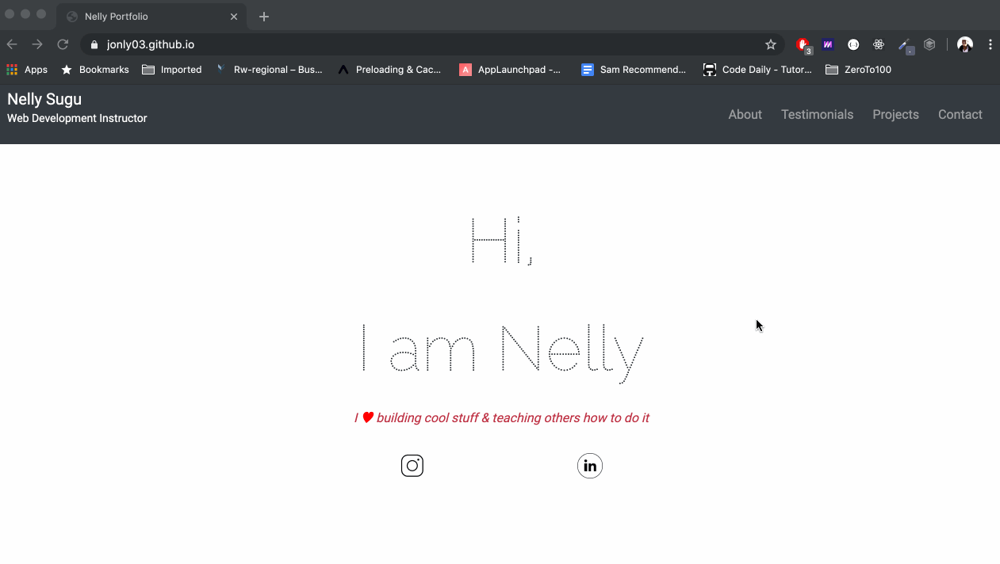
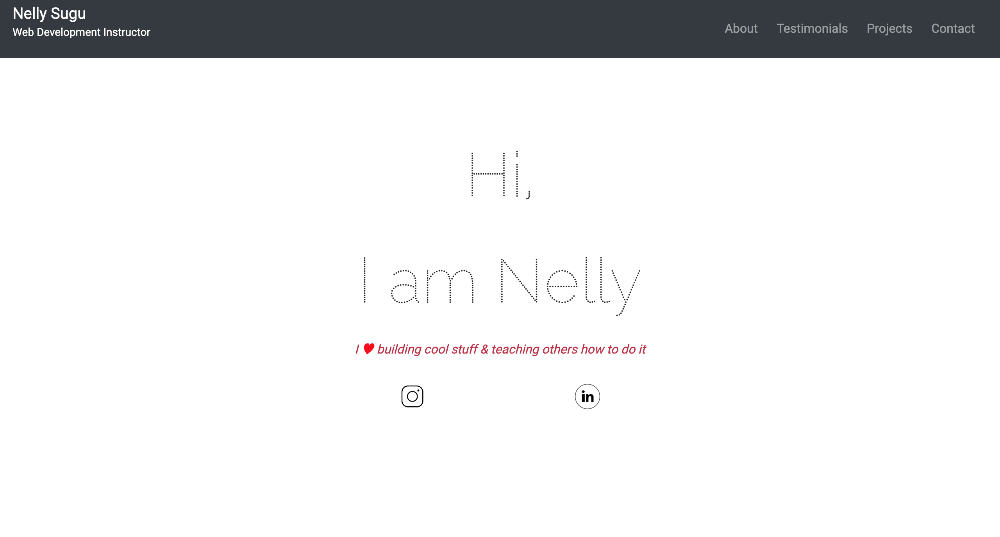
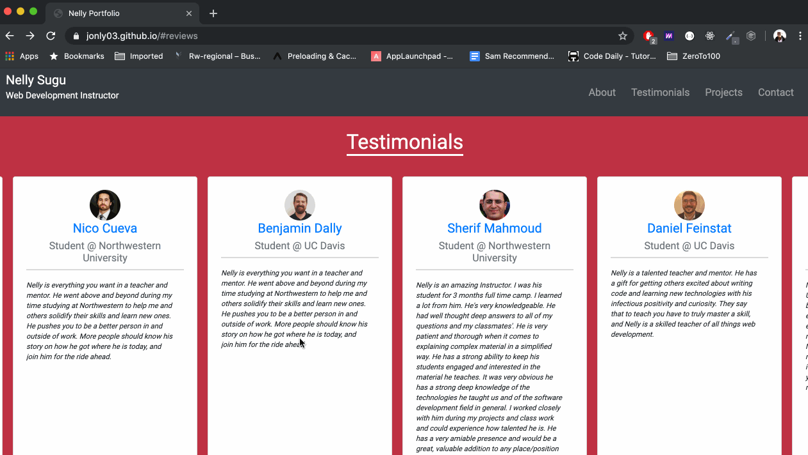
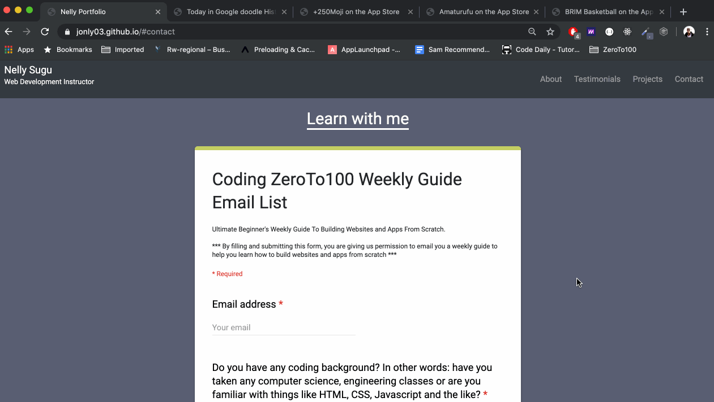
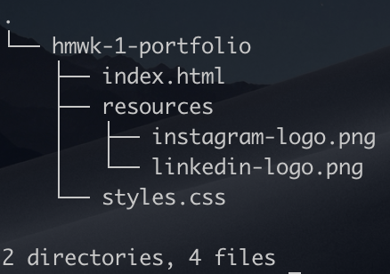

# Homework 1: Build a personal portfolio page

## Overview
You now know how to navigate around files on your computer using the command line. You have also learned how web pages are layed out using HTML. You also know how to make them look beautiful with CSS styles by specifying how you want your HTML `<tags/>`, `#ids` and `.classes` to look. The concept of a responsive web page is not strange to you anymore. You are well aware of the varying sizes of devices and can build responsive web pages using CSS media queries and/or CSS libraries like [Bootstrap](https://getbootstrap.com/). And when you are done building your web page, you now know how to publish it for the whole world to see using [Github pages](https://pages.github.com/).

During Homework 1, you will put all the above to practice and build yourself a portfolio page. This portfolio page will be a work in progress through out the duration of the class. By the end of this homework you will have built the first version of the portfolio you will share with potential employers and/or clients when you are done with the bootcamp.

This time around, your portfolio page will not have a ton of projects to show off because you have not built any yet. Neither will it have a ton of reviews/testimonials/recommendations. But as the class progresses and you build more projects, you will be adding them to your portfolio. 

When the class is over, this portfolio will be really important as you look for a web development job or endeavor into freelancing. It will be proof of what you are capable of building as a web developer because it will showcase your work and all the great things your classmates/clients/teammates have to say about how awesome it is to work with you. 

Even after the class is over, you are encouraged to keep building more cool projects and showing casing them on your portfolio. And as you get more reviews/testimonials/recommendations from your classmates, clients, co-workers, employers, etc keep adding them to your portfolio

## Page overview
NOTE: This overview outlines the minimum requirements. When you have met the requirements and you still have time, you are encouraged to go above and beyond with your creativity and make this portfolio as unique to you as you can. For example, you can use different background colors of your liking by using [RapidTables](https://www.rapidtables.com/web/color/html-color-codes.html) or Chrome extensions like [ColorZilla](https://chrome.google.com/webstore/detail/colorzilla/bhlhnicpbhignbdhedgjhgdocnmhomnp?hl=en) to pick any color off your favorite websites. Likewise, feel free to get creative with your fonts by using any font of your liking from places like [Google Fonts](https://fonts.google.com/)

Your portfolio should have a navigation bar with your name and at least 4 navigation tabs `About`, `Testimonials`, `Projects`, and `Contact`. 

Clicking on your name should have the same effect as clicking on the `About` navigation tab, they should both show the `About` page. Likewise, clicking on the `Testimonials`, `Projects` and `Contact` navigation tabs should show their respective pages as shown in the gif below.

Your portfolio page should be responsive to accomodate different screen sizes as shown in the gif below

- `About` page overview
    * On the `About` page, you should have at least a quick introduction of yourself as pictured below. For example your name and a quick blub about you. Be creative and unique. Under your introduction, you should also have at least 1 link to your LinkedIn profile. The link should be the LinkedIn logo. If you have other relevant platforms to showcase, use their logos as links here as well as shown in the picture below.

    

    * Clicking on the platforms logos below your introduction should open your profile on those platforms in a new tab as shown in the gif below.

    
    

- `Testimonials` page overview
    * On the `Testimonials` page, you should have at least 6 testimonial cards aligned horizontally and going off the page as shown in the gif below.

    * Each testimonial card should have an image thumbnail of the reviewer above the card's title. The title of the card should be a link with the reviewer's name that opens in a new tab as demonstrated in the gif below. A card subtitle is optional. If you don't have any testimonials yet, generate some for yourself using this [testimonial generator](http://testimonial-generator.com/index.php). The goal is to eventually replace these automatically generated testimonials with real ones from real people like your classmates.

    

- `Projects` page overview
    * On the `Projects` page, you should have at least 4 cards project cards aligned horizontally and spaced evenly.

    * As shown in the gif below, each project card should have, at the very top, an image or video or gif representing the project. Below the image/video/gif, the card should have the title of the project. Below the project title, the card should have a description section. And below the description of the project, the card should have a call to action button link that opens in a new tab.

    * Since we have not done any projects yet for you to showcase, you can use placeholders. For placeholder images, you can use [Unsplash images](https://unsplash.com/) or [Picsum photos](https://picsum.photos/) or [Placeholder](https://placeholder.com/) or any other placeholder images of your choosing. For project names you can use `Project I`, `Project II`, `Project III`, etc for simplicity or get creative and come up with your own names. For projects description, you can use this [Lorem Ipsum generator](https://www.lipsum.com/) or any other text of your choosing. The goal here is for you to nail down the layout.

    

- `Contact` page overview
    * The purpose of this `Contact` page is for people to reach out to you. Some people that might be interested in contacting you might be potential employers or clients. One way to grab their inputs is through a Google Form. As shown in the gif below, on the `Contact` page you will have a Google Form that your visitors will fill out and submit (more information on how to do this in the Instructions section)

    
    
## Instructions

1. File structure
    * Using the terminal, create a new directory on your computer and name it `hmwk-1-personal-portfolio`

    * Using the terminal, create 2 files inside of your new homework directory and name them `index.html` and `styles.css` in which you will write your portfolio page HTML and CSS

    * Using the terminal, create 1 sub-directory inside of your new homework directory and name it `resources`. This is where your local resources (images, etc) will live

    When you are done, your file structure should look like the picture below 
    

2. Page layout (`index.html`)
    * In the `<head></head>`:
        - Remember to link to Bootstrap CSS as specified [here](https://getbootstrap.com/docs/4.3/getting-started/introduction/)
        - Remember to link to your `styles.css` stylesheet
        - Remember to link to any third party font if you are using any
        - Remember to give a `<title></title>` to your page

    * Before closing of your `</body>`, remember to include Bootstrap JS as specified [here](https://getbootstrap.com/docs/4.3/getting-started/introduction/)

    * In the `<body></body>`:
        - Use [Bootstrap navbar](https://getbootstrap.com/docs/4.3/components/navbar/) to create your navigation bar with your name and 4 navigation tabs: `About`, `Testimonials`, `Projects`, and `Contact`. Remember that you can copy paste the code from the Bootstrap page and modify it to fit your page's needs.

        - Create 4 sections with the following ids: `#about`, `#testimonials`, `#projects`, `#contact` and build their respective pages.

        - Link your nav tabs to your section ids by pointing the `href` of your `.nav-link` to the section ids.

        - For the `Testimonials` and `Projects` pages, use the [Bootstrap cards](https://getbootstrap.com/docs/4.3/components/card/) to present your data.

        - To get the Google Form for the `Contact` page:
            * Use your gmail account and create a Google Form with questions you would like your portfolio visitors to fill out. 
            * Create a Google Sheet for the responses your visitors will enter.
            * Look up how to embed a Google Form on a web page.

3. HAVE FUN AND HELP EACH OTHER OUT!